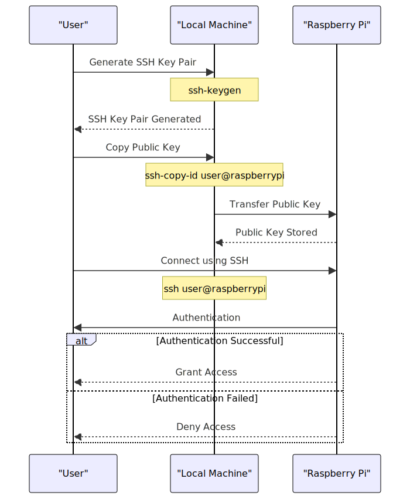

# Setting up SSH key to Donkey

To facilitate remote development and operation of your Donkey car, setting up SSH (Secure Shell) access is essential. SSH enables secure command execution on your Raspberry Pi from a local computer without physical connection needs. This guide details setting up SSH key-based authentication, enhancing security and convenience by eliminating the need to enter a password for each connection.

## Prerequisites

- A Donkey car equipped with a Raspberry Pi.
- A local computer with SSH client software installed. Most Linux and macOS systems have this installed by default. Windows users can use PuTTY or the built-in Windows SSH client.
- Both the Donkey car and your local computer should be connected to the same network.
- Ensure the Raspberry Pi is powered on and has network connectivity.
- SSH must be enabled on the Raspberry Pi. 

## Steps

### 1. Find the IP Address of the Raspberry Pi

Knowing the IP address of your Raspberry Pi is crucial for establishing an SSH connection. There are several methods to find this information:

- **Through your router**: Access your router's administration interface to see a list of connected devices. Look for the Raspberry Pi by its hostname (often `raspberrypi`) or MAC address.
- **Using network scanning tools**: Tools like `nmap` or `Angry IP Scanner` can scan your network for devices. The Raspberry Pi will be listed among the detected devices.

### 2. Generate SSH Key Pair

On your **local machine**, generate an SSH key pair (a public and a private key). This key pair is used to securely authenticate your computer without a password.

- **On Linux/macOS**, open a terminal and use the following command:
```bash
  ssh-keygen -t rsa -b 2048
```

Follow the prompts to choose a save location and passphrase (optional but recommended for added security).

- **On Windows**, if using PuTTY, use the PuTTYgen tool to generate a key pair. For the built-in Windows SSH client, use the same command as Linux/macOS in PowerShell or Command Prompt.

### 3. Transfer the Public Key to Raspberry Pi

Copy your **public key** to the Raspberry Pi to allow password-less SSH access. Replace your_pi_ip with the Raspberry Pi's IP address and pi with the username if you've changed it from the default.

```bash
ssh-copy-id pi@your_pi_ip
```

You'll be prompted to enter the user's password on the Raspberry Pi one last time.

**Never share your private key with anyone.** Keep it secure and never expose it to unauthorized individuals.

### 4. Connect to the Raspberry Pi via SSH

Now that your public key is added to the Raspberry Pi's authorized keys, you can connect without entering a password:

```bash
ssh pi@your_pi_ip
```

If you set a passphrase for your private key, you might be prompted to enter it.

### 5. Verifying Connection

Once connected, you should have access to the Raspberry Pi's terminal. Try running a command like ls or hostname to confirm the connection and access.
Conclusion

You've successfully set up SSH key-based authentication for your Donkey car's Raspberry Pi. This setup not only improves your development workflow by enabling remote access but also secures connections by leveraging cryptographic keys.

## Flow Diagram

